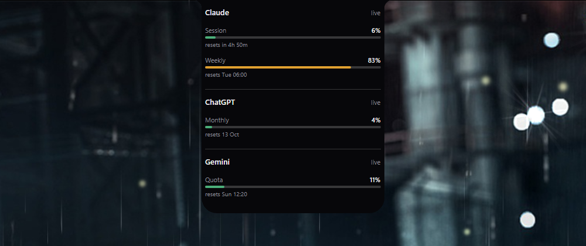

# Notchpoint

A notch for Windows 11 that shows how much of your AI usage is left.

It hangs from the top edge of your screen, hides itself until you need it, and costs about 15 MB and no measurable CPU to leave running all day.



Move the mouse to the top of the screen and it appears.
Click it and it opens.


## What it shows

| Provider | Read from | Windows shown |
|---|---|---|
| **Claude** | Claude Code's own credentials | 5-hour session, weekly |
| **ChatGPT** | Codex CLI's own credentials | monthly |
| **Gemini** | Antigravity, over loopback | rolling quota |

Each provider shows a ring only if you have that tool installed.
A ring never draws an arc when the reading failed, because an empty ring would look like "plenty left", which is the one wrong answer a usage meter must never give.

It also knows whether Claude Code is **working** or **waiting on you**, and spins the ring while it works.

## Install

Download the latest `NotchpointSetup-x.y.z.exe` from the [Releases page](https://github.com/iamprincejkc/Notchpoint/releases/latest) and run it.

One file, about 11 MB, nothing else to install.
There is no .NET runtime or other prerequisite, because the app is compiled ahead of time to native code.

It installs **per user**, so there is no administrator prompt.
Everything goes under `%LOCALAPPDATA%\Programs\Notchpoint`, and it registers in Apps & Features like any normal program.

The installer offers two optional tick boxes:

- **Start Notchpoint when I sign in to Windows.**
- **Install Claude Code session hooks.** Off by default, because it edits `settings.json`, where your own hooks live. It is append-only, backs the file up first, and uninstalling removes only its own entries.

### winget

Not yet. The manifests are written and validated, in [`winget/`](winget), but a package only becomes installable by name once Microsoft accepts it into their index, which is a separate review. `winget install JKC.Notchpoint` will start working when that lands.

## First run

**There is nothing to sign in to.**

Notchpoint reads the credentials the tools you already use have written for themselves.
If you are signed in to Claude Code, Codex or Antigravity, the matching ring lights up on its own within a few seconds.

If a ring says "needs sign-in", sign in to that tool the normal way and Notchpoint picks it up on its next read.
There is no password field in Notchpoint and there never will be.
Sign-in opens each vendor's own browser flow, and an app that asks for your Anthropic or OpenAI password directly is indistinguishable from one phishing you.

## Using it

The notch stays hidden, leaving a 2-pixel strip along the very top of the screen, so it never covers a browser tab.

- **Throw the mouse at the top edge** to reveal it.
- **Click** to expand the detail card, with a bar and a reset time per window.
- **Move away** to dismiss it.
- **Right-click the tray icon** for Settings, Refresh usage now, and Quit.

A few behaviours worth knowing:

- Rings carry a letter, `C` for Claude and `G` for ChatGPT, so you can tell them apart without relying on colour.
- A spinning arc means a Claude Code session is working right now.
- You get a tray balloon at 80% and 100% of any window, once per crossing.
- It hides completely while a fullscreen game or video owns the screen, because a topmost window costs presentation latency in games.
- Numbers refresh when you open the notch, when you bring an AI app to the front, and when you sign in to one, as well as on a timer.

## Settings

Right-click the tray icon and choose **Settings**, or run `Notchpoint.exe settings`.

You can change the notch size, which providers get a ring, whether it starts with Windows, whether it yields to fullscreen apps, and whether the Claude Code hooks are installed.

## Privacy

- Notchpoint reads credential files, it never writes them, and it never refreshes or rotates a token. Refreshing a token behind Claude Code's back can sign you out of the tool you actually work in.
- Nothing is sent anywhere except to each provider's own usage endpoint, using that provider's own credential.
- Gemini is read over loopback from a process already running on your machine. No credential is involved.
- There is no telemetry, no analytics and no update check.

## Uninstall

Apps & Features, or the **Uninstall Notchpoint** shortcut in the Start menu.

Your settings at `%APPDATA%\Notchpoint` are kept on purpose, and the uninstaller tells you where they are.
Delete that folder by hand if you want them gone.

Uninstalling also removes Notchpoint's own hook entries from `settings.json` and leaves every other hook exactly where it was.

## Requirements

- Windows 10 or 11, 64-bit.
- That is all.

## Troubleshooting

**"Windows protected your PC" when running the installer.**
The installer is not code-signed yet, so SmartScreen warns about it.
Click **More info**, then **Run anyway**.
You can check the file against the SHA256 published on the release before you do.

**A ring is missing.**
Notchpoint only shows a provider whose tool is installed.
Open Settings to see what it detected.

**Gemini says "not running".**
That is normal and not an error, it just means Antigravity is closed.
Open Antigravity and the ring fills in by itself.

**Everything looks wrong and you want to see why.**

```bash
Notchpoint.exe doctor
```

That prints which credentials were found, whether each endpoint answered, whether the hooks are installed, and where the notch decided to place itself.

## Credits

Inspired by [vinzdg/codenotch](https://github.com/vinzdg/codenotch) for macOS.
No code is shared between the two.

Notchpoint is closed source and free to use.
